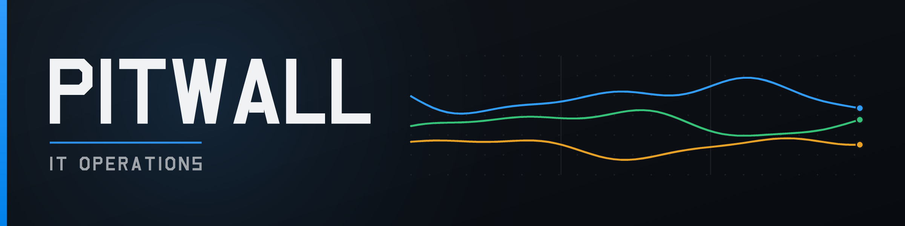

<!-- markdownlint-disable-next-line MD041 -- banner precedes the heading by design -->


# PitWall IT Operations

An operations layer for Microsoft 365 IT teams: unified administration,
visibility, safe changes and audit across Microsoft Entra ID and Microsoft
Intune.

It sits on top of Microsoft Graph. Microsoft remains the source of truth — this
is not a replacement for Entra or Intune, and does not try to be.

> **Source available, not open source.** Licensed under the
> [Business Source License 1.1](LICENSE). You may run PitWall in production,
> including as an MSP administering your own clients' tenants. Offering it to
> third parties as a competing hosted service requires a commercial licence.
> Converts to Apache 2.0 on 2030-08-10. See [docs/licensing.md](docs/licensing.md).

## Status

Phase 1 foundation plus the MVP surface: authentication, tenant connection,
tenant isolation, RBAC, the Graph integration layer, synchronisation, users,
devices, groups, global search, dashboard and audit.

See [docs/architecture.md](docs/architecture.md) for the shape of it, and the
"deliberately not built yet" section there for what is missing and why.

- [docs/next-steps.md](docs/next-steps.md) — what to pick up next, and the loose
  ends currently left in the code
- [docs/roadmap.md](docs/roadmap.md) — the phases, and what is deliberately not
  planned
- [docs/graph-permissions.md](docs/graph-permissions.md) — every Graph permission
  requested, and why
- [docs/licensing.md](docs/licensing.md) — what the BUSL permits in practice

## Stack

Laravel 13 · PHP 8.4 · MySQL · Redis · React 19 · TypeScript · Tailwind 4 · Vite

## Getting started

### 1. Register the Entra application

Register **one multi-tenant** application in Microsoft Entra ID. Customer
tenants grant admin consent to it; you never hold their credentials.

- Supported account types: *Accounts in any organizational directory*
- Redirect URIs (Web):
  - `http://localhost:8000/auth/microsoft/callback`
  - `http://localhost:8000/auth/microsoft/consent/callback`
- API permissions: see [docs/graph-permissions.md](docs/graph-permissions.md)
- Create a client secret

### 2. Configure

```bash
cp .env.example .env
php artisan key:generate
```

Set `MS_GRAPH_CLIENT_ID` and `MS_GRAPH_CLIENT_SECRET`. The secret is
server-side only and must never reach the frontend.

### 3. Run

With Docker:

```bash
docker compose up -d
docker compose exec app php artisan migrate
npm install && npm run dev
```

Without Docker, provide your own MySQL and Redis, then:

```bash
composer install
npm install
php artisan migrate
composer run dev     # serve + queue worker + logs + vite
```

The queue worker is not optional. Synchronisation and device actions run on the
queue, and nothing will refresh without it.

### 4. Connect a tenant

Sign in, then **Connect a Microsoft 365 tenant**. A Global Administrator of that
tenant grants admin consent; whoever connects it becomes its Owner. The first
synchronisation starts within a few minutes.

## Tests

```bash
php artisan test
```

The security-critical suites are worth knowing by name:

| Suite | Covers |
| --- | --- |
| `TenantIsolationTest` | No path from one tenant's session to another's data |
| `AuthorizationTest` | Roles grant exactly what they are supposed to |
| `GraphClientTest` | Retry, throttling, pagination, typed Graph failures |
| `AuditLogTest` | Entries cannot be altered or deleted |

## Layout

```text
app/Domain/                        Business logic by area
app/Integrations/MicrosoftGraph/   The only code that calls Microsoft
app/Http/                          Controllers, middleware, resources
app/Jobs/                          Queued synchronisation
resources/js/                      React SPA
docs/                              Architecture, permissions, next steps
```

## Licence

Business Source License 1.1 — see [LICENSE](LICENSE).

Production use is permitted, including by an MSP administering its own clients'
Microsoft 365 tenants. Offering PitWall to third parties as a hosted or managed
service that competes with it requires a commercial licence. Each version
converts to Apache 2.0 four years after its release.

This is **source available**, not OSI open source. See
[docs/licensing.md](docs/licensing.md) for the practical implications, including
the two placeholders that must be filled in before the repository is published.

The PitWall name and banner are trademarks and are not covered by the source
licence.
